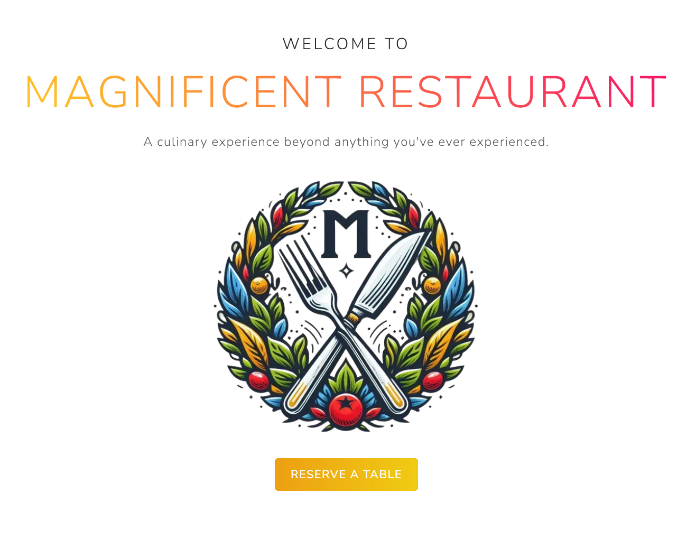

# Reliable Reservations Client

 

  

&nbsp;

## 🔭 Overview
 This modern, user-friendly web application is designed to streamline the process of reserving restaurant tables. It offers an intuitive interface for customers to select meals, choose dates and times, pick desired tables, and easily specify any special requirements for their visit.

&nbsp;

## ✨ Features

- 🧙‍♂️ Multi-step Reservation Wizard

- 🍳 Meal Selection

- 📅 Interactive Date and Time Picker

- 🪑 Visual Table Selection

- 🎭 Special Requests

- 📱 Responsive Design

---
&nbsp;
### ⚙️ Prerequisites

- Node.js (v14.0.0 or later)
- npm (v6.0.0 or later)

&nbsp;
## 🛠️ Technologies Used

- ⚛️ React
- ⚡ Vite
- 🧭 React Router
- 🎨 React Bootstrap
- 🌐 Axios
- 🧹 ESLint

&nbsp;

---

Thank you for checking out Reliable Reservations! I hope it helps streamline your restaurant reservation process.